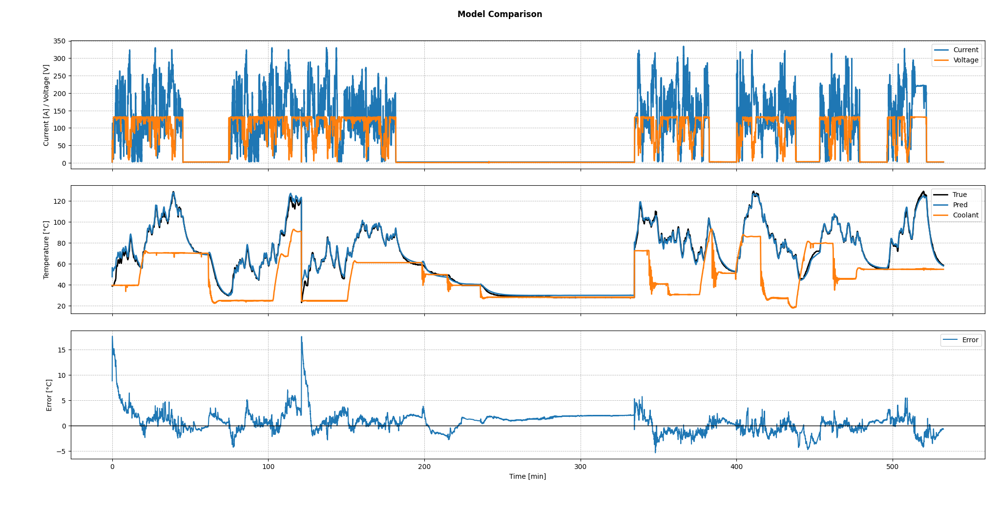
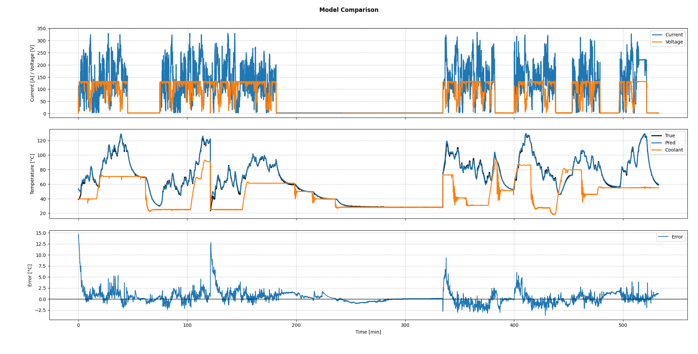

# 🧠 ThermoPINN

**Physics-Informed Neural Network for Motor Thermal Prediction**

---

## 🌡️ Overview

**ThermoPINN** combines *data-driven sequence modeling* with *first-principles thermal physics* to predict stator winding 
temperatures of electric machines. It merges an **LSTM-based temporal network** with an **RC thermal model constraint**, 
creating a hybrid model that respects both data and physics.

This approach enables:
- Accurate long-term temperature prediction  
- Consistency with energy conservation and thermal dynamics  
- Reduced need for labeled data  
- Robust generalization across operating conditions  

---

## 📂 Dataset

This project uses the **Electric Motor Temperature Dataset**:

> Wilhelm Kirchgässner, Oliver Wallscheid, and Joachim Böcker. (2021).  
> *Electric Motor Temperature [Data set]*. Kaggle.  
> [https://doi.org/10.34740/KAGGLE/DSV/2161054 ](https://doi.org/10.34740/KAGGLE/DSV/2161054 )

You can download the dataset directly from Kaggle and place it into the `data/` folder of the repository.

## 🧩 Motivation

Electric motor thermal behavior is typically modeled using **lumped-parameter RC networks**, where heat flow between 
nodes (stator, housing, coolant, etc.) follows differential equations derived from the **heat balance law**. However, 
these models rely on difficult-to-identify parameters (thermal resistances and capacitances), limiting accuracy in 
varying conditions.

Pure neural networks, in contrast, capture nonlinear relationships but often **violate physical constraints** and 
generalize poorly outside training regimes. **ThermoPINN** bridges this gap by embedding the RC-model physics 
directly into the learning objective.

---

## ⚙️ Mathematical Formulation

### 1. Thermal RC Model

A standard **first-order RC model** for the temperature hotspot $T_j$ can be expressed as:

$$
C_{th} \frac{dT_j}{dt} = P_{loss} - \frac{T_j - T_{amb}}{R_{th}}
$$

where:
- $C_{th}$: thermal capacitance [J/K]  
- $R_{th}$: thermal resistance [K/W]  
- $P_{loss}$: power loss input [W]  
- $T_{amb}$: ambient or coolant temperature [°C]  

Rearranging gives the **temperature dynamics**, this ODE defines the **governing physics constraint**

$$
\frac{dT_j}{dt} = \frac{1}{C_{th}} P_{loss} - \frac{1}{R_{th} C_{th}} (T_j - T_{amb})
$$


---

### 2. LSTM-Based Temperature Prediction

The **LSTM network** learns to approximate the mapping:

$$
\hat{T}_j(t) = f_\theta(X_t)
$$

where:
- $X_t = [P_{loss}(t), T_{amb}(t), \dots]$ is the multivariate input sequence  
- $f_\theta$ denotes the LSTM with parameters $\theta$  

The model predicts the temperature trajectory over time using sequential dependencies.

---

### 3. Physics-Informed Loss Function

The **total loss** combines *data-driven* and *physics-informed* components:

$$
\mathcal{L}_{total} = \mathcal{L}_{data} + \lambda_{phys} \, \mathcal{L}_{phys}
$$

#### a) Data Loss
Supervised error between predicted and measured temperatures:

$$
\mathcal{L}_{data} = \frac{1}{N} \sum_{i=1}^N (\hat{T}_j^{(i)} - T_j^{(i)})^2
$$

#### b) Physics Loss
Enforces the ODE constraint using automatic differentiation:

$$
\mathcal{L}_{phys} = \frac{1}{N} \sum_{i=1}^N 
\left(
\frac{d\hat{T}_j^{(i)}}{dt} - 
\left[
\frac{1}{C_{th}} P_{loss}^{(i)} - 
\frac{1}{R_{th} C_{th}} (\hat{T}_j^{(i)} - T_{amb}^{(i)})
\right]
\right)^2
$$

The derivative $\frac{d\hat{T}_j}{dt}$ is computed via PyTorch’s automatic differentiation (`torch.autograd.grad`) or
approximated via temperature gradients using Euler Forward/Backward or trapezoidal rule.

---

### 4. Normalization and Windowing

Input features are normalized and fed to the network using a **sliding window** approach:
$$
X_t = [x_{t-w+1}, \dots, x_t]
$$
where $w$ is the sequence length enabling the LSTM to learn temporal dependencies efficiently.

---

## 🧠 Network Architecture

```python
class LSTM_PINN(nn.Module):
    def __init__(self, input_dim, output_dim, hidden_dim=128, num_layers=2, dropout=0.2):
        super().__init__()
        self.lstm = nn.LSTM(input_dim, hidden_dim, num_layers, batch_first=True, dropout=dropout)
        self.fc = nn.Linear(hidden_dim, output_dim)

    def forward(self, x):
        out, _ = self.lstm(x)
        out = self.fc(out)
        return out
```    


## 🚀 Results

Table I: Results for NN, and PINN model on generalisation set (ID60, ID62, ID74) in terms of MAE/MSE/MAX error.

| Test ID   | MSE (NN/PINN)           | MAE (NN/PINN)          | MAX (NN/PINN)         |
|-----------|-------------------------|------------------------|-----------------------|
| 60        | 9.70 / 3.59             | 2.02 / 1.09            | 17.7 / 14.6           | 
| 62        | 5.04 / 2.08             | 1.63 / 0.77            | 17.6 / 12.8           | 
| 74        | 2.78 / 2.07             | 1.35 / 1.06            | 5.78 / 9.31           |
| --------- | ----------------------- | ---------------------- | --------------------- |
| Avg       | 5.26 / 2.41             | 1.61 / 0.95            | 17.7 / 14.6           |

### NN-Results




### PINN-Results



## 🧭 Installation

```bash
git clone https://github.com/yourusername/ThermoPINN.git
cd ThermoPINN
pip install -r requirements.txt
```