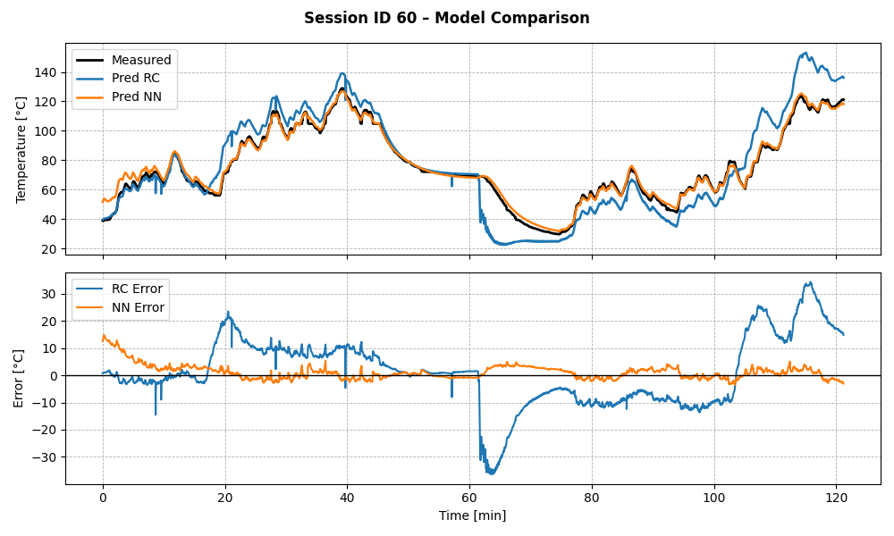

# ThermoPINN

**Physics-Informed Neural Network for Motor Thermal Prediction**

## Overview

ThermoPINN combines classical RC thermal modeling with a physics-informed LSTM neural network to predict junction temperatures of electric motors. By integrating the underlying thermal physics into the loss function, the model achieves accurate temperature estimation while respecting physical laws.

Key features:
- RC thermal parameter identification from step response data
- Physics-informed loss for LSTM sequence prediction
- Data normalization and sliding-window sequence generation
- Flexible training, validation, and test split
- Optional visualization of predictions and errors

---

## Installation

Clone the repository and install required packages:

```bash
git clone https://github.com/yourusername/ThermoPINN.git
cd ThermoPINN
pip install -r requirements.txt
```

## Results

Table I: Results generalisation set in therms of MAE/MSE/MAX error.

| Test ID | RC                    | NN                   | PINN                |
|---------|-----------------------|----------------------|---------------------|
| 60      | 9.83 / 162.56 / 36.42 | 2.57 / 10.47 / 16.85 | 2.03 / 8.43 / 14.69 | 
| 62      | 2.42 / 17.74  / 22.40 | 2.30 / 7.82 / 16.16  | 1.29 / 4.44 / 14.43 | 
| 74      | 9.91 / 181.12 / 40.43 | 2.10 / 6.66 / 8.13   | 1.47 / 3.16 / 6.97  | 

### NN-Results

| ID-60                                   | ID-62                                   | ID-74                                   |
|-----------------------------------------|-----------------------------------------|-----------------------------------------|
|   |   |   |


### PINN-Results

| ID-60                                       | ID-62                                       | ID-74                                       |
|---------------------------------------------|---------------------------------------------|---------------------------------------------|
|   |   |   |

